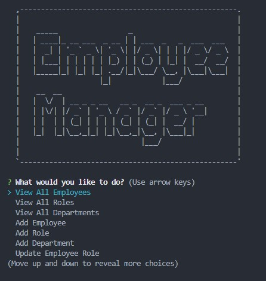

# Employee-Tracker

## Description

The Employee Tracker is a very smooth tool to get a look at the databases that are seeded with data on employees, departments, roles, and IDs set for these roles. You can also create, delete, and get some other useful info about various things from the database.
This handy CLI tool could be utilized very easily by any company trying to have a quick database of their employees.
Through the process of creating this, I learned how to set up some more in depth sql files, as well as getting middleware set up to have everything easily accessed in the command line. The problem I ran into was found within that same middleware that stored the functions, and I was never able to get them to be read properly, even with help. 

## Table of Contents (Optional)

N/A

## Installation

N/A

## Usage

## Credits

TA help from Sam Cordova, and office hours help from Diana Vu, Reed Meher and Nathan Hedglin. Course work and Stack Overflow also used as sources. 
